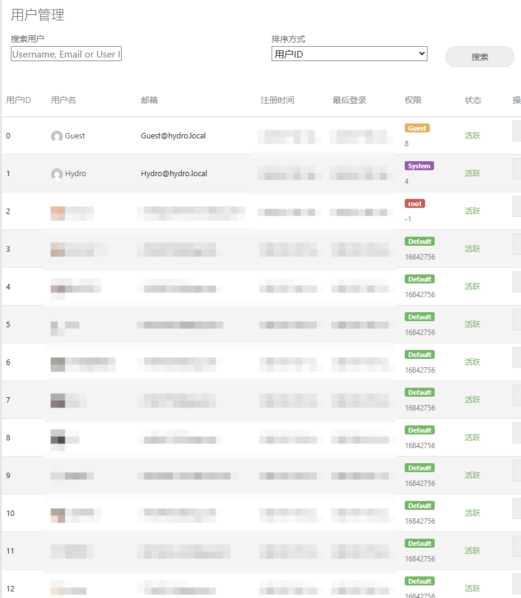
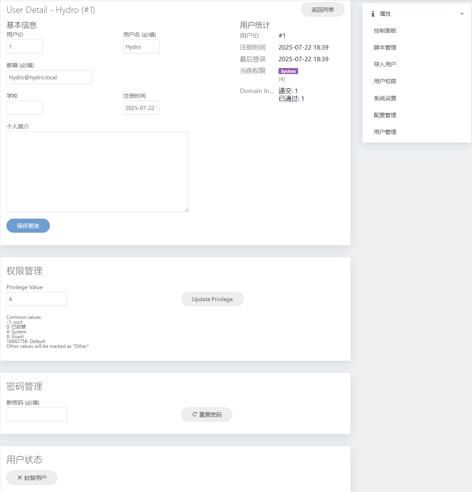

# HydroOJ插件 用户管理面板

一个为 HydroOJ 提供可视化用户管理功能的插件，允许管理员在控制面板中方便地管理用户信息、权限和状态。

> 代码很简单，佛系不定期更新~
>
> 如果认为好用请给我点一个star，不胜感激。

## 安装方法

```bash
sudo su
cd /root/.hydro/
git clone https://github.com/SummerofOrange/hydrooj-user-management
hydrooj addon add /root/.hydro/hydrooj-user-management
pm2 restart hydrooj
```

## 使用方法

1. **访问用户管理**: 登录 HydroOJ 后，在控制面板侧边栏找到"用户管理"菜单项
2. **搜索用户**: 在用户列表页面使用搜索框查找特定用户
3. **编辑用户**: 点击用户列表中的"编辑"按钮进入用户详情页面
4. **管理权限**: 在用户详情页面的"权限管理"部分设置用户权限
5. **重置密码**: 在"密码管理"部分为用户重置新密码
6. **封禁用户**: 在"用户状态"部分封禁或解封用户

## 权限说明

插件使用以下权限级别：

- **-1**: root（超级管理员）
- **0**: 已封禁用户
- **4**: 系统保留
- **8**: 访客用户
- **16842756**: 默认用户权限
- **其他值**: 自定义权限

## 界面展示

### 用户列表页面



### 用户详情页面



## 安全特性

- ✅ 权限验证：只有具有系统管理权限的用户才能访问
- ✅ 操作确认：重要操作（如重置密码、封禁用户）需要确认
- ✅ 权限保护：防止非超级管理员修改超级管理员账户
- ✅ 数据验证：自动验证用户名和邮箱的唯一性
- ✅ 输入验证：前端和后端双重验证用户输入

## 开发说明

### 贡献代码

欢迎提交 Issue 和 Pull Request 来改进这个插件。

## 许可证

MIT License

## 支持

如果您在使用过程中遇到问题，请：

1. 查看 [Issues](https://github.com/SummerofOrange/hydrooj-user-management/issues) 页面
2. 提交新的 Issue 描述您的问题
3. 联系作者获取技术支持

---

**注意**: 此插件需要 HydroOJ v5.0.0-beta.6 或更高版本。使用前请确保您有足够的系统管理权限。
